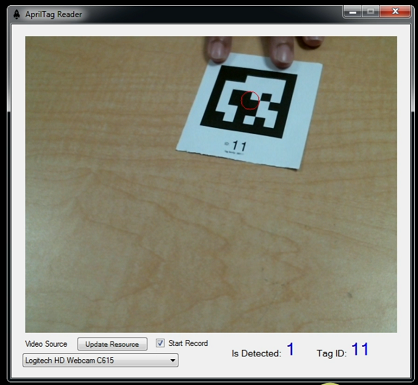

# AprilTagWindowForm

## Description

This project creates a Window Form application written in C# allowing users to detect AprilTag.

AprilTag is a visual fiducial system. Its application widely ranges from augmented reality, robotics, and camera calibration. AprilTag is developed by April Robotic Lab. Please find more information at the lab's [website](https://april.eecs.umich.edu/software/apriltag). April Robotic Lab provides a well-developed library to establish programs detecting AprilTag. In addition, the supported library allows the programs to be written in many languages, such as C, and Python.

Herein, this program demonstrates the detection of AprilTag using Windows Form written with C#.

This program is built based on the work of [BlackJocker1995](https://github.com/BlackJocker1995/Apriltagcsharp) and [Goh Chulin](https://github.com/goh-chunlin/WebcamWinForm)

- **BlackJocker1995** provides C# source codes to detect AprilTag. The original repository can be found [here](https://github.com/BlackJocker1995/Apriltagcsharp).
- **Goh Chulin** writes the library to detect video capture devices and stream their images with C#. The original work can be found [here](https://github.com/goh-chunlin/WebcamWinForm).
- The successful operation of this program is credited to their works.

Herein, I combine their works to make a simple program allowing the users to use as a base to develop their AprilTag applications with Windows Form and C#.

The program is written to detect the tag36h11 family. The users might modify its code to work with other families. This convenience is allowed as **BlackJocker1995**'s library enables the detection of several tag families.

I tested my program with [Logitech Webcam C615](https://www.logitech.com/en-us/products/webcams/c615-webcam.960-000733.html). It is expected that the program works fine with other webcams, as **Goh Chulin** tested his library successfully with [Logitech HD Webcam C270](https://www.logitech.com/en-us/products/webcams/c270-hd-webcam.960-000694.html)

The demonstration video can be found [here](https://youtu.be/W1fL9RylnOQ).

## Nesseray Nuget Packages

- DirectShowLib.1.0.0
- OpenCvSharp4.4.6.0.20220608
- OpenCvSharp4.Extensions.4.6.0.20220608
- OpenCvSharp4.runtime.win.4.6.0.20220608

## License

This work is distributed under the GPL-3.0 License found in the LICENSE file.
